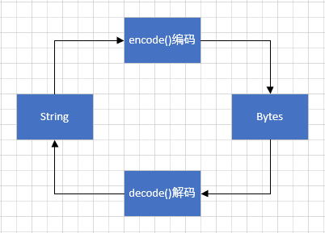

## 概述
最早接触到Python大概是在2009年，当时还在各大塞班（Symbina）论坛逛帖子，那时候大家都叫“大蟒蛇平台”，其实是python发音的一种音译。诺基亚的Symbina智能手机上支持C++和JAVA开发的两类程序， 装上Python后，也就可以支持众多以Python开发的各种程序了。曾经一度想自己编写，下载了论坛置顶资料，后来还是被不知道丢到哪里~

近两年python随着人工智能，数据分析，网络爬虫的火爆，python的天然优势又出来了，越来越多的人开始关注到python，其中包括我，十一年过去了，我又要“重新启航”了。

学习一门语言，先从基本数据类型开始吧。

## Number-数字

### 整数

包括正整数与负整数，如：8，-100等, 整型是没有限制大小的，可以当做long类型使用（没有 python2 中的 Long）

    2 进 制：以'0b'开头。例如：'0b11011'表示10进制的27
    8 进 制：以'0o'开头。例如：'0o33'表示10进制的27
    10进制：正常显示
    16进制：以'0x'开头。例如：'0x1b'表示10进制的27

各进间数字进行转换（内置函数）：

    bin(i)：将i转换为2进制，以“0b”开头。
    oct(i)：将i转换为8进制，以“0o”开头。
    int(i)：将i转换为10进制，正常显示。
    hex(i)：将i转换为16进制，以“0x”开头。

### 浮点数

浮点数也就是小数，整数和浮点数在计算机内部存储的方式是不同的，整数运算永远是精确的（除法难道也是精确的？是的！），而浮点数运算则可能会有四舍五入的误差。浮点型也可以使用科学计数法表示（2.5e2 = 2.5 x 102 = 250）

### 布尔值

在 Python2 中是没有布尔型的，它用数字 0 表示 False，用 1 表示 True。到 Python3 中，把 True 和 False 定义成关键字了，但它们的值还是 1 和 0，它们可以和数字相加。注意大小写写法。

    print(True == 1) # True
    print(False == 0) # True

下列对象的布尔值是False：

    None；False；0（整型），0.0（浮点型）；0L（长整形）；0.0+0.0j（复数）；“”（空字符串）；[]（空列表）；（）（空元组）；{}（空字典）

### 复数
Python可以表示复数，日常用到复数的不过，先复习下复数的相关概念：

1. 把形如z=a+bi（a,b均为实数）的数称为复数，其中a称为实部，b称为虚部，i称为虚数单位，i2=-1;

2. 将复数的实部与虚部的平方和的正的平方根的值称为该复数的模，记作`∣z∣`

关于复数的理解可以查看底部参考文章来进一步了解。

我们回到Python语法中：

    a=4.7+0.666j           #定义一个虚数
    print(a)               #输出这个虚数
    print(a.real)          #输出实部
    print(a.imag)          #输出虚部
    print(a.conjugate())   #输出该复数的共轭复数

运行结果：

    (4.7+0.666j)
    4.7
    0.666
    (4.7-0.666j)

除了直接定义外，还可以通过`complex()`，创建一个复数或者将一个数或字符串转换为复数形式：

    complex(3.2,0.005) # (3.2+0.005j)
    complex(1)    # (1 + 0j)
    complex('2+0.01j')  # (2+0.01j)

### CRUD

    n=100           # Create
    del n           # Delete 删除变量
    print(n)        # 访问报错

### 随机函数 

random标准库为Python提供了生成随机数的工具（以下方法使用时需`import random`）

| 函数名 | 描述 |
| ---    | ---  |
| choice(seq)	| 从序列的元素中随机挑选一个元素，比如random.choice(range(10))，从0到9中随机挑选一个整数。|
| randrange 	| ([start,] stop [,step])	从指定范围内，按指定基数递增的集合中获取一个随机数，基数默认值为 1	|
| random()	| 随机生成下一个实数，它在[0,1)范围内。	|
| seed([x])	| 改变随机数生成器的种子seed。如果你不了解其原理，你不必特别去设定seed，Python会帮你选择seed。	|
| shuffle(lst)	| 	将序列的所有元素随机排序|
| uniform(x, y)		| 随机生成下一个实数，它在[x,y]范围内。	|

### 数学函数

math标准库为Python提供了常用数学方法（以下方法除了`abs,max,min,pow,round`内置函数外，使用时均需`import math`）

| 函数名 | 描述 |
| ---    | ---  |
| abs(x) | 	返回数字的绝对值, 如abs(-10) 返回 10| 
| max(x1, x2,...)	| 返回给定参数的最大值，参数可以为序列。| 
| min(x1, x2,...)	| 返回给定参数的最小值，参数可以为序列。| 
| pow(x, y)| 	x**y 运算后的值。| 
| round(x [,n])| 	返回浮点数 x 的四舍五入值，如给出 n 值，则代表舍入到小数点后的位数。其实准确的说是保留值将保留到离上一位更近的一端。| 
| ceil(x)	| 返回数字的上入整数, 如math.ceil(4.1) 返回 5 |
| exp(x)| 	返回e的x次幂(ex), 如math.exp(1) 返回2.718281828459045| 
| fabs(x)	| 返回数字的绝对值, 如math.fabs(-10) 返回10.0| 
| floor(x)| 	返回数字的下舍整数，如math.floor(4.9) 返回 4| 
| log(x)	| 如math.log(math.e)返回1.0,math.log(100,10)返回2.0| 
| log10(x)	| 返回以10为基数的x的对数，如math.log10(100)返回 2.0| 
| modf(x)	| 返回x的整数部分与小数部分，两部分的数值符号与x相同，整数部分以浮点型表示。math.modf(3.1415)) 返回 (0.14150000000000018, 3.0)| 
| sqrt(x)| 返回数字x的平方根。math.sqrt(100) 返回 10.0| 
| acos(x)	| 返回x的反余弦弧度值。| 
| asin(x)	| 返回x的反正弦弧度值。| 
| atan(x)| 	返回x的反正切弧度值。| 
| atan2(y, x)	| 返回给定的 X 及 Y 坐标值的反正切值。| 
| cos(x)	| 返回x的弧度的余弦值。| 
| hypot(x, y)	| 返回欧几里德范数 sqrt(x*x + y*y)。| 
| sin(x)	| 返回的x弧度的正弦值。| 
| tan(x)	| 返回x弧度的正切值。| 
| degrees(x)	| 将弧度转换为角度,如degrees(math.pi/2) ， 返回90.0| 
| radians(x)| 	将角度转换为弧度| 

### 数学常量

同样需要引入math标准库

| 常量名 | 描述 |
| ---    | ---  |
| pi | 	数学常量 pi（圆周率，一般以π来表示）, math.pi| 
| e	| 数学常量 e，e即自然常数（自然常数）, math.e| 

## String-字符串

字符串是以单引号`'`或双引号`"`或者三引号`'''`括起来的任意文本，如果需要包含引号，请用转义符`\`,如：

    print('Tom say:\"Hello!\"')
三引号支持换行

    print('''
    Hi Lili
    Hi Tom''')

字符串的截取的语法格式为：`变量[头下标:尾下标]`,`+`号拼接，`*`号复制：

    str = 'Hello world'
    print (str)          # 输出字符串
    print (str[0:-1])    # 输出第一个到倒数第二个的所有字符
    print (str[0])       # 输出字符串第一个字符
    print (str[2:5])     # 输出从第三个开始到第五个的字符
    print (str[2:])      # 输出从第三个开始的后的所有字符
    print (str * 2)      # 输出字符串两次，也可以写成 print (2 * str)
    print (str + "TEST") # 连接字符串

运行结果：

    Hello world
    Hello worl
    H
    llo
    llo world
    Hello worldHello world
    Hello worldTEST

字符串元素不可被修改,如下操作会报错：

    str = 'Hello world'
    str[0]='C'
    print(str) # TypeError: 'str' object does not support item assignment

f-string 格式化字符串以 f 开头，后面跟着字符串，字符串中的表达式用大括号 {} 包起来，它会将变量或表达式计算后的值替换进去

### Bytes 类型

Python3 新增 bytes 类型，是指一堆字节的集合，十六进制表现形式，两个十六进制数构成一个 byte ，用带b前缀的单引号或双引号来表示。bytes通常用于网络数据传输、二进制图片和文件的保存等等。  

Bytes 与 String 可以相关转换

举个例子：

    b1 = bytes()
    print(b1) # b''
    str='你好'
    result=str.encode(encoding='utf-8') # b'\xe4\xbd\xa0\xe5\xa5\xbd'
    print(result)
    print(result.decode(encoding='utf-8')) # 你好

### 转义与格式化

在需要在字符中使用特殊字符时，python用反斜杠`\`转义字符(同js)。

在 Python 中，字符串格式化使用与 C 中 sprintf 函数一样的语法。

    print ("我叫 %s 今年 %d 岁!" % ('小明', 10)) # 我叫 小明 今年 10 岁!

### CRUD

    str='abc'            # Create
    print('p'+str[1:3])  # Update  无法修改，可以通过+号重新创建
    print(str[0])        # Retrieve 
    del str              # Delete 删除变量，不同于列表，集合，字典等，依旧可以访问
    print(str)           #  <class 'str'>

### f-string

f-string 是 python3.6 之后版本添加的，称之为字面量格式化字符串，是新的格式化字符串的语法。

之前我们习惯用百分号 (%):

    name = "Jack"
    print("My name is %s" %name)    # My name is Jack

如果采用f-string表达更简单了（类似NodeJs中的模板字符串）

    print(f"My name is {name}")     # My name is Jack

### String类型方法

| 方法名 | 描述 | 例子 |
| ---    | ---  | ---  | 
| len(string) | 返回字符串长度 | 略 |
| lower() | 转换字符串中所有大写字符为小写| 略 |
| upper() |转换字符串中的小写字母为大写| 略 |
| swapcase() |将字符串中大写转换为小写，小写转换为大写| 略 |
| capitalize() | 将字符串的第一个字符转换为大写| 略 |
| title() | 返回"标题化"的字符串,就是说所有单词都是以大写开始，其余字母均为小写(见 istitle())| 略 | 
| join(seq) | 以指定字符串作为分隔符，将 seq 中所有的元素(的字符串表示)合并为一个新的字符串 |以`s='-'`为例：`s.join(('h','e','l','l','o'))` : `h-e-l-l-o`   `s.join(['h','e','l','l','o'])`：`h-e-l-l-o`  `s.join({'h','e','l','l','o'}` : `l-e-o-h`(每次均不同)|
| center(width, fillchar) | 返回一个指定的宽度 width 居中的字符串，fillchar 为填充的字符，默认为空格(不能完全居中就有出现偏移)|以`s='[go]'`为例： `s.center(10,'*')`：`***[go]***`  `s.center(11,'*')`：`****[go]***`|
| count(`str, beg= 0,end=len(string)`)|返回 str 在 string 里面出现的次数，如果 beg 或者 end 指定则返回指定范围内 str 出现的次数| `"abab".count('ab')`：`2`  `"abab".count('ab',2,4)`：`1` |
| bytes.decode(`encoding="utf-8", errors="strict"`)| Python3 中没有 decode 方法，但我们可以使用 bytes 对象的 decode() 方法来解码给定的 bytes 对象，这个 bytes 对象可以由 str.encode() 来编码返回| `('好'.encode("UTF-8")).decode('UTF-8','strict')` : `好` |
| encode(`encoding='UTF-8',errors='strict'`) | 以 encoding 指定的编码格式编码字符串，如果出错默认报一个ValueError 的异常，除非 errors 指定的是'ignore'或者'replace'| `"好".encode('UTF-8')`：`b'\xe5\xa5\xbd'`  `"好".encode('GBK')`：`b'\xba\xc3'`|
| endswith(`suffix, beg=0, end=len(string)`)|指定后缀结尾，如果是返回 True，否则返回 False，可选参数 "start" 与 "end" 为检索字符串的开始与结束位置| `'abc!!'.endswith('!!',3,5)` ：`True` |
| expandtabs(tabsize=8) | 把字符串 string 中的 tab 符号 `\t`转为空格，tab 符号默认的空格数是 8|略 | 
| find(str, beg=0, end=len(string))|检测 str 是否包含在字符串中，如果指定范围 beg 和 end ，则检查是否包含在指定范围内，如果包含返回开始的索引值，否则返回-1 | `"abcd".find('ab',0,1)` ：-1 |
| index(str, beg=0, end=len(string)) | 跟find()方法一样，只不过如果str不在字符串中会报一个异常| `"abcd".find('ab',0,1)` ：报错 |
| rfind(str, beg=0,end=len(string)) | 类似于 find()函数，不过是从右边开始查找 | 略 | 
| rindex( str, beg=0, end=len(string)) | 类似于 index()，不过是从右边开始 | 略 | 
| isalnum() | 如果字符串至少有一个字符并且所有字符都是字母或数字则返 回 True，否则返回 False | 略 |
| isalpha()  | 如果字符串至少有一个字符并且所有字符都是字母或中文字则返回 True, 否则返回 False |略 |
| isdigit() | 如果字符串只包含数字则返回 True 否则返回 False|略 |
| isnumeric() | 如果字符串中只包含数字字符，则返回 True，否则返回 False |略 |
| islower() | 如果字符串中包含至少一个区分大小写的字符，并且所有这些(区分大小写的)字符都是小写，则返回 True，否则返回 False |略 |
| isspace() | 如果字符串中只包含空白，则返回 True，否则返回 False |略 |
| istitle() | 如果字符串是标题化的(见 title())则返回 True，否则返回 False |略 |
| isupper() | 如果字符串中包含至少一个区分大小写的字符，并且所有这些(区分大小写的)字符都是大写，则返回 True，否则返回 False |略 |
| ljust(width[, fillchar]) | 返回一个原字符串左对齐,并使用 fillchar(默认为空格) 填充至长度 width 的新字符串, 如果指定的长度小于原字符串的长度则返回原字符串| `"abcd".ljust(10,'@')`：`abcd@@@@@@` 
| rjust(width,[, fillchar])|同ljust，不同的是返回一个右对齐的原字符串|略 |
| lstrip([chars]) |截掉字符串左边的空格或指定字符(默认截掉左边空格)。| `"111abcd11".lstrip('1')`：`abcd11` |
| rstrip([chars]) | 功能同 lstrip ，不过截取的为字符串右边空格或指定字符|略 |
| strip([chars]) | 在字符串上执行 lstrip()和 rstrip() |略 |
| max(str) | 返回字符串 str 中最大的字母|略 |
| min(str) | 返回字符串 str 中最小的字母|略 |
| replace(old, new [, max]) | 把 将字符串中的 str1 替换成 str2,如果 max 指定，则替换不超过 max 次|
| split(`str="", num=string.count(str)`) | 通过指定分隔符对字符串进行切片，如果第二个参数 num 有指定值(默认全部分隔)，则分割为 num+1 个子字符串| s="a1bc1d" `s.split('1',1)`：`['a', 'bc1d']`  `s.split('1',5)`：`['a', 'bc', 'd']` |
| splitlines([keepends]) |按照行`('\r', '\r\n', \n')`分隔，返回一个包含各行作为元素的列表，如果参数 keepends 为 False，不包含换行符，如果为 True，则保留换行符。|`'ab c\n\nde fg\rkl\r\n'.splitlines()`: `['ab c', '', 'de fg', 'kl']` |
| startswith(substr, beg=0,end=len(string)) | 检查字符串是否是以指定子字符串 substr 开头，是则返回 True，否则返回 False。如果beg 和 end 指定值，则在指定范围内检查| `"abcd".startswith('cd',2,4))` : `True` |
| maketrans() | 创建字符映射的转换表，对于接受两个参数的最简单的调用方式，第一个参数是字符串，表示需要转换的字符，第二个参数也是字符串表示转换的目标| `trantab = str.maketrans("aeiou", "12345")` (一般与translate搭配使用)|
| translate(table, deletechars="") |根据 str 给出的表(包含 256 个字符)转换 string 的字符, 要过滤掉的字符放到 deletechars 参数中|	`"this is string example".translate(trantab)` : `th3s 3s str3ng 2x1mpl2` |
| zfill (width) |返回长度为 width 的字符串，原字符串右对齐，前面填充0 |	`"abcd".zfill(10)`：`000000abcd`  `"abcd".zfill(1)` ：`abcd` |
| isdecimal() | 检查字符串是否只包含十进制字符，如果是返回 true，否则返回 false(方法只存在于unicode对象)| `"abcd".isdecimal()`：`True`  `"100".isdecimal()`：`False`|

## List-列表
List（列表） 是 Python 中使用最频繁的数据类型。   
列表是写在方括号 [] 之间、用逗号分隔开的元素列表。与Javascript中的数组非常相似。列表同样可以被索引和截取，列表被截取后返回一个包含所需元素的新列表。

操作与字符串很多相似之处:

    list = [1,0.02,True,'Hi']
    print(list[3])
    print(list[0:-1])
    print(list*2)
    print(list+['Tom'])
    print(list[0:3])
    print(list[0:3:2]) #截取可以接收第三个参数，参数作用是截取的步长

运行结果：

    Hi
    [1, 0.02, True]
    [1, 0.02, True, 'Hi', 1, 0.02, True, 'Hi']
    [1, 0.02, True, 'Hi', 'Tom']
    [1, 0.02, True]
    [1, True]

列表的元素不同于字符串，元素是可以被修改的

    list = [1,0.02,True,'Hi']
    list[0]='c'
    print(list)

运行结果：

    ['c', 0.02, True, 'Hi']

### CURD

废话不说，上代码：

    ls=[1,2,3]    # Create
    ls[0]=0       # Update
    print(ls[0])  # Retrieve
    del ls[2]     # Delete
    print(ls)     # [0, 2]
    del ls        # 删除变量，访问ls会报错

### List类型方法

设置`ls=[1,2,1]`，有如下表格：

| 方法名 | 描述 | 例子 |
| ---    | ---  | ---  |
| list.append(obj) | 在列表末尾添加新的对象，返回None |`ls.append((2,0))` ： [1,2,1,(2, 0)] |
| list.count(obj) | 统计某个元素在列表中出现的次数，返回次数|`ls.count(1)` ：2 |
| list.extend(seq) | 在列表末尾一次性追加另一个序列中的多个值,返回None |`ls.extend((2,0))` ： [1,2,1,2,0] |
| list.index(obj) | 从列表中找出某个值第一个匹配项的索引位置,返回索引 |`ls.index(1)` ：0 |
| list.insert(index,obj) | 将对象插入列表,返回为None | `ls.insert(1,-10)` ：[1, -10, 2, 1] |
| list.pop(index=-1) | 移除列表中的一个元素（默认最后一个元素），并且返回该元素的值 | `ls.pop(0)` ：[2,1] |
| list.remove(obj) | 移除列表中某个值的第一个匹配项,返回为None | `ls.remove(1)` ：[2,1] |
| list.reverse() | 反向列表中元素,返回为None | `ls.reverse()` ：[1,2,1] |
| list.sort(key=None, reverse=False) | key用来进行比较的元素;reverse :True降序,False升序（默认），返回None | `ls.sort()` ：[1,1,2] |
| list.clear() | 清空列表，返回None | `ls.clear()` ：[] |
| list.copy() | 复制列表，返回复制后的新列表(非指针) | `ls.copy()` ：[1,2,1]|

## Tuple-元组

元组（tuple）与列表类似，不同之处在于元组的元素不能修改。  
元组写在小括号 () 里，元素之间用逗号隔开（可以把字符串看作一种特殊的元组）

    tup = (1, 2, '3', 4.1, 5, 6)
    tup1 = ()    # 空元组
    tup2 = (20,) # 一个元素，需要在元素后添加逗号
    tup3 = (20) # 一个元素，不加逗号就变成的Number类型

    print(tup[0]) # 1
    print(tup1)   # ()
    print(type(tup2)) # <class 'tuple'>
    print(type(tup3)) # <class 'int'>

### CURD

相比列表，元组是无法修改的，所以只能更新出新元组

    tup=(1,2,3)         # Create
    print(tup + (4,5))  # tup[0]=0 会报错
    print(tup[0])       # Retrieve
    del tup             # del tup[2] 会报错 且删除后变量tup就不存在了

## Set-集合

集合（set）是由一个或数个形态各异的大小整体组成的，构成集合的事物或对象称作元素或是成员。基本功能是进行成员关系测试和删除重复元素。  

可以使用大括号 `{ }` 或者 `set()` 函数创建集合。不过创建一个空集合必须用 `set()` 而不是 `{ }`，因为 `{ }` 是用来创建一个空字典

    sites = {'b', 'a', 'b', 'a', 'y'}
    sitea = set(['b','a','t','t','l','e'])
    print(sites)  # 输出集合，重复的元素被自动去掉
    print(sitea)
    print(sites - sitea) # a 和 b 的差集
    print(sites | sitea)  # a 和 b 的并集
    print(sites & sitea) # a 和 b 的交集
    print(sites ^ sitea)  # a 和 b 中不同时存在的元素

运行结果：

    {'y', 'b', 'a'}
    {'e', 'l', 'a', 't', 'b'}
    {'y'}
    {'e', 'l', 'a', 't', 'b', 'y'}
    {'b', 'a'}
    {'y', 't', 'e', 'l'}

集合本身是一个无序的不重复元素序列，并不支持索引操作。

### CURD

集合本身不支持索引操作，常用操作中只剩下删除操作支持

    s={1,2,3}
    print(s)
    del s

### Set类型方法

以`set={1,2,1}`为例，有如下表格：

| 方法名 | 描述 | 例子 |
| ---    | ---  | ---  |
| set.add(ele)	| 为集合添加元素(只能添加Sting或Number)，返回None| `set.add('5')` ：{1, 2, '5'}|
| set.clear()	| 移除集合中的所有元素，返回None| `set.clear()` ：set()|
| set.copy()	| 拷贝一个集合 返回复制后的新集合(非指针) | `set.copy()` ：{1, 2}|
| set.update(obj) |	给集合添加元素 | `set.update({3,1,5})`  ：{1, 2, 3, 5}|
| set.pop()	| 随机移除元素,返回被删除的元素 | `set.pop()`  ：{}|
| set.remove(item) |	移除指定元素(元素不存在会报错) | `set.remove(2)`  ：{1} |
| set.difference(s)|	返回多个集合的差集，元素包含在集合 set中,但不在集合s中  |`set.difference({2,4})` ：{1} |
| set.difference_update(s)|	移除两个集合都包含的元素,返回None|`set.difference_update({2,4})` ：{1} |
| set.discard(calue)|	删除集合中指定的元素（功能等同remove,但不存在元素时不会报错）| `set.discard(4)` :{1,2}	|
| set.intersection(set1, set2 ... etc)|	返回两个或更多集合中都包含的元素，即交集|	自行测试 |
| set.intersection_update()|	获取两个或更多集合中都重叠的元素，不同于intersection，该方法会修改原始集合。|	自行测试 |
| set.isdisjoint(s)|	判断两个集合是否包含相同的元素，s中是否有包含集合set的元素,不包含返回 True，否则返回 False。|	自行测试 |
| set.issubset(s)|	用于判断集合的所有元素是否都包含在指定集合中，即 set 的所有元素是否都包含在集合 s 中,是则返回True，否返回False|	自行测试 |
| set.issuperset(s)|判断指定集合的所有元素是否都包含在原始的集合中, 即s 的所有元素是否都包含在集合 set 中，都包含返回True,否返回False|	自行测试 |
| set.symmetric_difference(s)|	返回两个集合中不重复的元素集合，即会移除两个集合中都存在的元素(返回新集合)|	自行测试 |
| set.symmetric_difference_update(s)|	原始集合set 中移除与 s 集合中的重复元素，并将不重复的元素插入到集合 set 中|	自行测试 |
| set.union(set1, set2...)|返回两个或多个集合的并集，即包含了所有集合的元素，重复的元素只会出现一次|	自行测试 |

## Dictionary-字典
字典（dictionary）是Python中另一个非常有用的内置数据类型。是一种映射类型，字典用 `{ }` 标识，它是一个无序的 键(key) : 值(value) 的集合,非常类似Javascript中的对象（key如果为String类型就必须用引号，这点与js不同）。

列表是有序的对象集合，字典是无序的对象集合。两者之间的区别在于：字典当中的元素是通过键来存取的，而不是通过偏移存取。

    dicta={'name':'jack','age':12}
    dictb=dict([('name','tom'),('job','worker')])
    print(dicta)
    print(dicta.keys())
    print(dicta.values())
    print(dictb)
    print(dicta['name'])

运行结果：

    {'name': 'jack', 'age': 12}
    dict_keys(['name', 'age'])
    dict_values(['jack', 12])
    {'name': 'tom', 'job': 'worker'}
    jack

### CURD
与列表非常类似，因为字典键值的唯一性与不可变性，通过键值来进行索引（键必须不可变，所以可以用数字，字符串或元组充当，而用列表就不行）

    dict={'name':'Tom','age':12}    # Create
    dict['name']='Jack'             # Update
    print(dict['name'])             # Retrieve
    del dict['age']                 # Delete
    print(dict)                     # {'name': 'Jack'}
    del dict                        # 删除变量，访问dict会报错

### Dictionary类型方法

以`dit={'s':"Tom",1:'14'}`为例，有如下表格：

| 方法名 | 描述 | 例子 |
| ---    | ---  | ---  |
| dict.clear()	| 删除字典内所有元素，返回None| `dit.clear()` ：{}|
| dict.copy()	| 返回一个字典的浅复制, 深拷贝父对象（一级目录），子对象（二级目录）不拷贝，还是引用（赋值操作只是复制了一个指针）| `dit.copy()`：`{'s':'Tom', 1:'14'}` |
| dict.fromkeys(seq[, value]) | 创建一个新字典，以序列 seq 中元素做字典的键，value 为字典所有键对应的初始值| `dict.fromkeys((1,2,3),0)`: `{1: 0, 2: 0, 3: 0}` (注意必须通过dict实例或者dict类名来调用)|
| dict.get(key, default=None)  | 返回指定键的值，如果键不在字典中返回默认值。| `dit.get('s')`：Tom  `dit.get('t')`：None |
| dict.setdefault(key, default=None) | 与get类似，如果键不已经存在于字典中，将会添加键并将值设为默认值(不同于get,该方法会修改dict)| `dit.setdefault(2)` ：`{'s': 'Tom', 1: '14', 2: None}`|
| key in dict | in 操作符用于判断键是否存在于字典中，存在返回True，否则返回False | `'s' in dit`：True |
| key not in dict | not in 操作符与in正好相反| `'s' not in dit`：False |
| dict.items()|以列表返回可遍历的(键, 值) 元组数组|`dit.items()` : `dict_items([('s', 'Tom'), (1, '14')])` |
| dict.keys()|返回一个可迭代对象，可以使用 list() 来转换为列表 | `list(dit.keys())` ：`['s', 1]` |
| dict.update(dict2) | 字典参数 dict2 的 key/value(键/值) 对更新到字典 dict 里，返回None，直接修改dict| `dit.update({'t':0}`：`{'s': 'Tom', 1: '14', 't': 0}`|
| dict.values() | 返回一个迭代器，可以使用 list() 来转换为列表，列表为字典中的所有值 | ：`dict_values(['Tom', '14'])`
| pop(key[,default]) | 删除字典给定键 key 所对应的值，返回值为被删除的值,如果key值不存在，则返回default，否则就报错 | `dit.pop('s',99)`：`Tom`(如果s不存在则会返回99，否则报错) |
|popitem() | 删除字典中的最后一对键和值, 并返回删除的键值（元组） | `dit.popitem()` : `(1, '14')` |

## 参考文章
- [PYTHON3基本数据类型](https://www.cnblogs.com/aiwanbuhui/p/7766352.html)
- [怎么理解虚数和复数？ - 李狗嗨的回答 - 知乎](https://www.zhihu.com/question/46877027/answer/542742130)