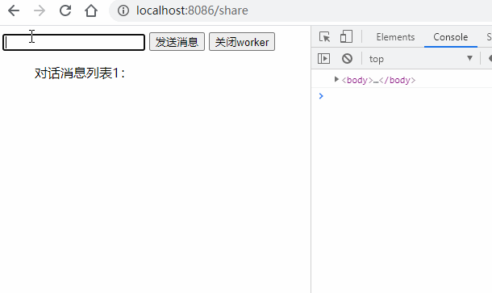

# {{$frontmatter.title}}

工作中用到两个iframe（兄弟关系）互相通信的问题，除了通过统一的父级之外，在思考还有没有其他更优解，这时候想到了Service Worker,既然谈到这个，那就重头捋一下，各种“woker”的前世今生。

谈到Web Worker 与 Service Worker，经常出现的高频词汇还有PWA，离线应用，缓存等，我们先了解下，这些名词的含义：

## Application Cache

应用缓存，最早HTML5 规范中设计了应用缓存（Application Cache）这么一个新的概念。通过它，我们可以做离线应用。在控制台中我们也能发现它的身影：


然而，由于这个 API 的设计有太多的缺陷，被很多人吐槽，最终被废弃。废弃的原因有兴趣的可以查看：[为什么app cache没有得到大规模应用？它有哪些硬伤吗？](https://www.zhihu.com/question/29876535)

并且该特性已经从 Web 标准中删除，虽然一些浏览器目前仍然支持它，但也许会在未来的某个时间停止支持，请尽量不要使用该特性（源自MDN 描述）。

## CacheStorage

为了能够精细地、可编程地控制缓存，CacheStorage 被设计出来。有了它，开发者就可以用 JS 对缓存进行增删改查。MDN web docs上是这么定义的：

CacheStorage 接口表示 Cache 对象的存储。它提供了一个 ServiceWorker 、其它类型worker或者 window 范围内可以访问到的所有命名cache的主目录（它并不是一定要和service workers一起使用，即使它是在service workers规范中定义的），并维护一份字符串名称到相应 Cache 对象的映射。


## Web Worker

JS是单线程的，并且与 GUI 渲染线程是互斥的([想了解更多请点我](https://weblog.wangminghuan.cn/%E6%B5%8F%E8%A7%88%E5%99%A8%E6%B8%B2%E6%9F%93%E9%A1%B5%E9%9D%A2%E8%BF%87%E7%A8%8B%E8%A7%A3%E6%9E%90/#more/)), 如果进行一些密集型或耗时计算，UI页面会被阻塞住（或放慢），进入“假死”状态，这时 Web Workers 便诞生了。Web Worker属于HTML5的标准，ECMAScript中并没有，换言之就是nodejs中并不存在各种“woker”。他有如下特点：

- 同源限制：分配给 Worker 线程运行的脚本文件，必须与当前站点域名一致,且无法加载本地文件。
- DOM 限制：无法读取主线程所在网页的 DOM 对象，但可以读取navigator对象和location对象。
- Web Worker只能服务于新建它的页面，不同页面之间不能共享同一个 Web Worker（如需共享需使用Shared Worker）。
- 当页面关闭时，该页面新建的 Web Worker 也会随之关闭，不会常驻在浏览器中。

下面我们通过一个实际的例子来说明：

html文件逻辑如下（省略部分公共部分）：
```  
  <input type="number" id="ipt">
  <button id="btns">发送</button>
  <button id="close">关闭worker</button>
  <ul class="list">
    <p>执行结果为：<b></b></p>
  </ul>
  <script type="text/javascript">
  var worker= new Worker('ww.js')
  worker.onmessage= e=>{
    $(".list b").text($("#ipt").val()+" x 100 = "+e.data)
    console.log("worker run result is "+e.data)
  }
  $("#btns").click(()=>{
    var num=$("#ipt").val();
    console.log("send data is "+num)
    worker.postMessage(num)
  })
  $("#close").click(()=>{
    console.log("---worker is close---")
    worker.terminate();
  })
  </script>
```
执行的worker文件ww.js，代码如下：
```  
  this.onmessage=e=>{  //self和this都代表线程本身，也可省略不写
    const message=e.data;
    console.log("web worker get message")
    self.postMessage(message*100)
  }
```  
得到执行结果为：


- 主线程采用new命令，调用Worker()构造函数，新建一个 Worker 线程
- worker线程与主线程之间通过postmessage与onmessage完成通信
- 然woker线程也可以关闭自身：`self.close()`

在控制台此处可以看到ww.js中的代码（Network中也可以看到ww.js的请求）


## Shared Worker

上面提到 Web Worker 无法共享的问题，Shared Worker可以说就是专门解决此问题而出现的。它可以创建一个执行指定 url 脚本的共享 web worker。不过这些页面必须是同源的（相同的协议、host 以及端口）

依旧创建两个页面进行测试（share 与 share2，代码基本一致）：
```
  <input type="text" id="ipt">
    <button id="btns">发送消息</button>
    <button id="close">关闭worker</button>
    <ul class="list">
      <p>对话消息列表1：</p>
    </ul>
    <script type="text/javascript">
    var worker= new SharedWorker('swk.js',"share-worker-v1");
    worker.port.start();
    worker.port.onmessage= e=>{
      console.log(e)
      $(".list").append("<li style='color:red'>worker回："+e.data+"</li>")
    }
    $("#btns").click(()=>{
      const val=$("#ipt").val()
      $(".list").append("<li style='color:red'>share1问："+val+"</li>")
      worker.port.postMessage(val)
    })
    $("#close").click(()=>{
      console.log("---worker is close---")
      worker.port.close()
    })
    </script>
```
执行的 Share Worker文件swk.js，代码如下：
```
  this.onconnect = function(e) {
      var port = e.ports[0];
      port.onmessage = function (e) {
        console.log(e)
        port.postMessage("Hi! "+e.data)
    }
  }
```
执行结果：


可以发现：
- 通过构造函数`SharedWorker`来创建Share Worker。
- 创建的 Share Worker 可以在多个页面运行，且互不干扰，各自监听各自的端口。
- 关闭当前页面的 share worker 并不会影响其他页面worker正常运行。
- 只有运行Share Worker的所有页面关闭，Share Worker也会自动关闭。
- share worker的执行可以通过`chrome://inspect/#workers`进行调试，当前页面无法调试（Network中不会出现swk.js文件）


我们将swk.js文件稍加改造，设置为广播模式，所有页面均可"共享"数据了
```
  const clients=[]
  this.onconnect = function(e) {
      var port = e.ports[0];
      clients.push(port)
      port.onmessage = function (e) {
        clients.map((item)=>{
          item.postMessage(e.data)
        })
    }
  }
```
此时我们在share页面与share2页面分别根据消息类型做不同的判断，即可获取对方页面的数据，实现"共享"：
```
  // share页面，share2页面与之类似
  worker.port.onmessage= e=>{
      if(e.data && e.data.type=='b'){
        $(".list").append("<li style='color:red'>接受到share2消息："+e.data.msg+"</li>")
      }
    }
    $("#btns").click(()=>{
      const val=$("#ipt").val()
      $(".list").append("<li style='color:red'>share1发送："+val+"</li>")
      worker.port.postMessage({
        type:"a",
        msg:val
      })
    })
```
运行结果：


## Service Worker

Service Worker 与 Web Worker 相比，相同点是：它们都是在常规的 JS 引擎线程以外开辟了新的 JS 线程。不同点主要包括以下几点：

- Service Worker 不是服务于某个特定页面的，而是服务于多个页面的。（按照同源策略）
- Service Worker 会常驻在浏览器中，即便注册它的页面已经关闭，Service Worker 也不会停止。本质上它是一个后台线程，只有你主动终结，或者浏览器回收，这个线程才会结束。
- 生命周期、可调用的 API 等等也有很大的不同。

### 创建
Service Worker必须是https协议的（本地服务可以为http），里面大量使用Promise来设计，且基本不能使用同步接口（localStorage与sessionStorage）,他的基本生命周期如下：

- Download – 下载注册的JS文件
- Install – 安装
- Activate – 激活

可以通过对应API监听到以下几种状态：

    installing → installed → activating → activated

只有处于activated 状态时才可正常使用。

参照张鑫旭的代码，我们创建一个Service Worker：
```
  if ('serviceWorker' in navigator) {
      // 开始注册service workers
      navigator.serviceWorker.register('sw.js').then( (registration)=> {
          console.log('注册成功');
          var serviceWorker;
          if (registration.installing) {
            serviceWorker = registration.installing;
            console.log('installing');
          } else if (registration.waiting) {
            serviceWorker = registration.waiting;
            console.log('waiting');
          } else if (registration.active) {
            serviceWorker = registration.active;
            console.log('active');
          }
          if (serviceWorker) {
            $('#swState').text(serviceWorker.state);
              serviceWorker.addEventListener('statechange', function (e) {
                $('#swState').append('&emsp;状态变化为' + e.target.state);
              });
          }
      }).catch ((error) =>{
        console.log('注册失败');
      });
  }
```
执行结果为：


### 通信

在此基础上测试下Service Worker的通信功能，修改html文件：
```
btns.addEventListener('click',()=>{
  console.log("send message to service!!")
  navigator.serviceWorker.controller.postMessage("Hi!");
});

navigator.serviceWorker.addEventListener("message", function(event) {
  console.log("***main process get message***")
  console.log(event.data)
});
```
sw.js文件内容为：
```
self.addEventListener("message", function(event) {
  console.log("--- service get data ---")
  self.clients.matchAll().then((clientList)=>{
    clientList.forEach(client => {
      client.postMessage("Hello service,I get you message:"+event.data)
    })
  })
});
```
我们再次执行，此处有个小插曲，就是sw.js文件的更新，需要在控制台中手动进行Unregister操作，否则无法更新Service Worker中的代码，在sw.js文件后面加时间戳也只会进入waiting状态：


也可结合业务实现自动更新，参见：[谨慎处理 Service Worker 的更新](https://zhuanlan.zhihu.com/p/51118741)，此处不再赘述。

接着上面的代码，重新执行后，点击按钮向service worker发送消息：


### 拦截请求

Service Worker 可以拦截页面的所有的请求（包括图片，静态资源，ajax）,在sw.js中增加监听:
```
self.addEventListener('fetch', function(event) { 
  console.log("拦截请求~")
  console.log(event)
});
```    
此时页面发出的请求均会被拦截到：


### 应用范围

Service Worker因为可以常驻浏览器，所以很多时候被拿来做缓存应用，可以参照张鑫旭童鞋的[demo](https://zhangxinxu.github.io/https-demo/cache/start.html)，Service Worker其实只是开了一个后台线程，所以具体怎么用，全凭与其他api的配合使用:

- 与 Fetch 搭配，可以从浏览器层面拦截请求，做数据 mock；
- 与 Fetch 和 CacheStorage 搭配，可以做离线应用；
- 与 Push 和 Notification 搭配，可以做类似 Native APP 的消息推送

Service Worker 是 Web Worker 进一步发展的产物，从其起步至今也不过两三年的时间，尚处在发展期，希望今后更加完善与易用。


## 参考
- [MDN-Web Worker API](https://developer.mozilla.org/zh-CN/docs/Web/API/Web_Workers_API)
- [MDN-Share Worker API](https://developer.mozilla.org/zh-CN/docs/Web/API/SharedWorker/SharedWorker)
- [MDN-Service Worker API](https://developer.mozilla.org/zh-CN/docs/Web/API/Service_Worker_API)
- [kailian blog - Service Worker是什么?](http://kailian.github.io/2017/03/01/service-worker)
- [浏览器缓存、CacheStorage、Web Worker 与 Service Worker](https://github.com/youngwind/blog/issues/113)
- [借助Service Worker和cacheStorage缓存及离线开发-张鑫旭](https://www.zhangxinxu.com/wordpress/2017/07/service-worker-cachestorage-offline-develop/)