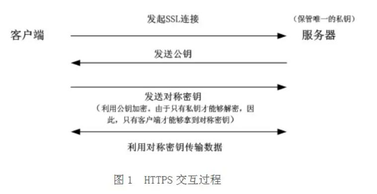

# {{ $frontmatter.title }}
作为web开发人员，相信大家都知道利用Fiddler/Charles等工具进行抓包，那这些抓包工具的原理是什么，对于某些APP为何抓不到请求，本文会记录一些在抓包工程中遇到的一些问题与解决方法


## 配置抓包工具

以常用的抓包工具:Fiddler(只支持windows)以及Charles(支持Windows,Macos,Linux)为例（ps: charles为收费软件，破解可访问[Charles 激活码计算器](https://www.zzzmode.com/mytools/charles/)）, 只需要简单配置即可抓取http/https，具体可参考：[Fiddler抓包简易教程](https://www.jianshu.com/p/9e05a2522758) 和 [十分钟学会Charles抓包(iOS的http/https请求)](https://www.jianshu.com/p/5539599c7a25)。这里不再赘述。


## 代理抓包原理

启动Fiddler 或 Charles就是启动了一个HTTP代理服务器, 这个时候运行在系统上的http客户端再去发送请求的时候，它就不会再去进行DNS解析，而是直接连接系统告诉他代理所在的地址，这样代理服务器会与客户端建立连接，再然后代理服务器根据请求信息再去连接真正的服务器：


Fiddler 或 Charles充当的就是中间人（MITM）。但随着爬虫在手机端的日益盛行，越来越多的APP无法通过中间人模式进行抓包了，这又是为何？

## 无法抓包的原因

总所周知，http协议作为应用层协议，在各端都有自己的实现，也就是说开发人员可以自己实现自己的http客户端，如android上最有名的okhttp 就是一个http客户端的实现。所以app中的http协议也可以不使用系统代理，在okhttp中我们可以这样设置：
```
builder.proxy(Proxy.NO_PROXY);
```
Flutter中也默认不会主动使用系统代理，需要单独设置，这样就绕开了系统代理，如何破局？


## 其他抓包方式
除了Fiddler 、Charles，Wireshark也是经常被人提到的，它可以捕获机器上的某一块网卡的网络包，不止HTTP请求，其他网络请求也会被捕获到，所以为了捕获特定请求需要自定义一个很长的过滤列表，对新手不是很友好。

另外，也可以使用VPN。VPN是构造了一个虚拟专用网络，实际上也是一种特殊的代理服务器，不过是在操作系统级别设置。VPN连接捕获其配置的设备的整个网络连接，也可以看作虚拟网卡，它会监控虚拟网卡上的所有请求（不只是HTTP请求），如安卓上的Packet Capture（无需root）：


不过这样抓到包不太好分析，于是有了另外一种方案：Drony+ Fiddler/Charles, Drony也是一款VPN软件，不过他可以将手机上的所有流量都重定向到drony自身，然后再将流量转发到Fiddler/Charles等代理服务器上去实现抓包（自己测试了很久一直没成功，最终只好放弃了）

## HTTPS加密基本原理

广义上你可以简单理解HTTPS = HTTP + TLS/SSL，但实际原理复杂很多。

http是明文传输，很容易被第三方“窃听”与“篡改”，所以要进行加密传输。最常见的算法就是对称加密，同一个密钥用来加密与解密，但这样密钥在传输过程很容易被“窃取”，所以加入了非对称加密算法：公钥与私钥（公钥加密的数据只有私钥才能解开，反义亦然），非对称加密虽然加密度高，但算法相对复杂，加密解密过程比较耗时，所以建立真正的连接之前会先进行三次握手，握手成功后就开始利用对称加密进行数据传输，流程如下：（服务端保存着唯一的私钥）：



等等，这样就完美了吗？中间人模式可以完美避开（Fiddler/Charles的代理模式），中间人也有着自己的公钥与私钥，在客户端与服务端交换过程中做手脚：


为了解决此问题，引入了数字证书的概念。服务器首先生成公私钥，将公钥提供给相关机构（CA），CA将公钥放入数字证书并将数字证书颁布给服务器。当客户端发起 HTTPS 请求时，服务器会返回站点的 SSL 证书，浏览器会对证书做：颁发机构信息、公钥、公司信息、域名、有效期、指纹等等一系列验证通过后，才会进行下一步获取非对称公钥操作。  

所以，HTTPS相当于：非对称加密算法（公钥和私钥）+ 数字证书验证身份 + 称密钥加解密后续传输的数据。

这也就是为什么要实现Fiddler/Charles的HTTPS抓包功能，就需要先将证书手动导入到受信任的CA机构下，否则无法实现抓包的原因。

## Chrome禁用代理模式

没事翻了下文档，发现chrome也支持禁用代理模式，启动时添加运行参数：`--no-proxy-server`，那么对于electron桌面应用可以再app实例ready之前设置：
```
app.commandLine.appendSwitch('no-proxy-server')
```
即可禁用代理模式

## 参考
- [知乎-抓包那点事](https://zhuanlan.zhihu.com/p/139645460)
- [还在为大厂app抓不到包而犯愁吗？](https://juejin.cn/post/6860818685763223565)
- [部分APP无法代理抓包的原因及解决方法（flutter 抓包）](https://www.cnblogs.com/lulianqi/p/11380794.html)
- [Electron 支持的命令行开关](https://www.electronjs.org/docs/api/command-line-switches#supported-command-line-switches)