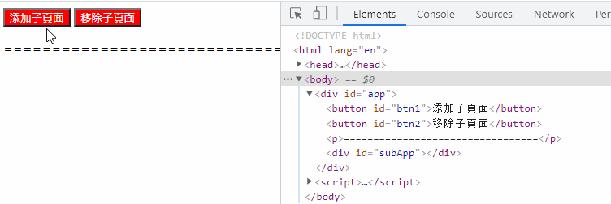
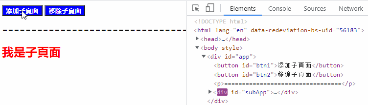

# {{$frontmatter.title}}
随着各种“微服务”的流行，“微前端”的概念也被创造出来，在浏览知乎时看到好几篇文章都与“微前端”相关，而[qiankun](https://qiankun.umijs.org/zh/guide)更是各类文章绕不开的话题。对于这种新兴的概念我们不表，技术终究是用来为业务服务的，不是越新越好，譬如：[你可能不需要微前端](https://zhuanlan.zhihu.com/p/392152863)中就比较中肯，微前端不是银弹，适合自己的才是最好的。

说了一大推，我们回到qiankun上，因为他不是iframe, 所以我一直比较好奇：它是如果实现应用之间的样式与运行时的隔离？

## 样式隔离
通常的实践是通过约定 css 前缀的方式来避免样式冲突，但这属于人为约定，无法保证结果。我们试图从纯技术角度来解决这个问题

### Shadow DOM
shadow DOM并不是一个特别新的概念，html中的video标签就是使用shadow DOM的一个案例。使用它时，你在html只会看到一个video标签，但实际上播放器上还有一系列按钮和其他操作，这些就都是封装到shadow dom中的，对外界是不可见的。所以Shadow DOM天然实现了样式隔离。

更多请访问：[MDN-使用 shadow DOM](https://developer.mozilla.org/zh-CN/docs/Web/Web_Components/Using_shadow_DOM)

### Dynamic Stylesheet
动态插入/移除样式DOM, 没错，这是一个及其简单的方式。原理是浏览器会对所有的样式表的插入、移除做整个 CSSOM 的重构，从而达到 插入、卸载 样式的目的：

qiankun采用就是这种方案。但这个方案并非完美，它只解决了子应用之间的样式隔离，对于主应用与子应用之间的样式隔离并未解决，参见：[你可能不需要微前端](https://zhuanlan.zhihu.com/p/392152863)

## JS沙箱
因为各个应用之间的全局变量会互相污染，所以JS沙箱比样式隔离的问题更棘手，社区的普遍玩法是给一些全局副作用加各种前缀从而避免冲突。但其实我们都明白，口头约定这种东西并不靠谱，而且对于已经开发完毕的老系统，这种约定方案并不适用。

其实这部分才是我一直好奇的地方，翻看几篇博客，大致明白了原理：

qiankun的沙箱隔离机制主要分为三种：

- legacySandBox
- proxySandBox
- snapshotSandBox

其中 legacySandBox、proxySandBox 是基于 Proxy API 来实现的，在不支持 Proxy API 的低版本浏览器中，会降级为 snapshotSandBox

这里我们梳理下主要设计思路，具体的代码实现可参考源码或文末的链接

### legacySandBox
legacySandBox 的本质上还是操作 window 对象，但是他会存在三个状态池，分别用于子应用卸载时还原主应用的状态和子应用加载时还原子应用的状态

- addedPropsMapInSandbox： 存储在子应用运行时期间新增的全局变量，用于卸载子应用时还原主应用全局变量；
- modifiedPropsOriginalValueMapInSandbox：存储在子应用运行期间更新的全局变量，用于卸载子应用时还原主应用全局变量；
- currentUpdatedPropsValueMap：存储子应用全局变量的更新，用于运行时切换后还原子应用的状态；

同样会对window造成污染(虽然污染已经降到了最低)，但是性能比快照沙箱好，不用遍历window对象。

### proxySandBox
在 qiankun 中，proxySandBox 用于多实例场景。一般我们的中后台系统同一时间只会加载一个子应用的运行时。但是也存在同一时间加载多个子应用的场景。

原理大致如下：激活沙箱后，每次对window取值的时候，先从自己沙箱环境的fakeWindow里面找，如果不存在，就从rawWindow(外部的window)里去找；当对沙箱内部的window对象赋值的时候，会直接操作fakeWindow，而不会影响到rawWindow。

### snapshotSandBox
对于不支持proxy的浏览器，会降级为此模式。主要的原理就是在子应用激活 / 卸载时分别去通过快照的形式记录/还原状态来实现沙箱的。通过对当前的 window 和记录的快照做 diff 来实现沙箱。

## 参考

- [可能是你见过最完善的微前端解决方案](https://zhuanlan.zhihu.com/p/78362028)
- [浏览器新特性--shadow DOM](https://www.jianshu.com/p/dc74e3705e4f)
- [15分钟快速理解qiankun的js沙箱原理及其实现](https://juejin.cn/post/6920110573418086413)
- [解密微前端：从qiankun看沙箱隔离](https://segmentfault.com/a/1190000038219823)
