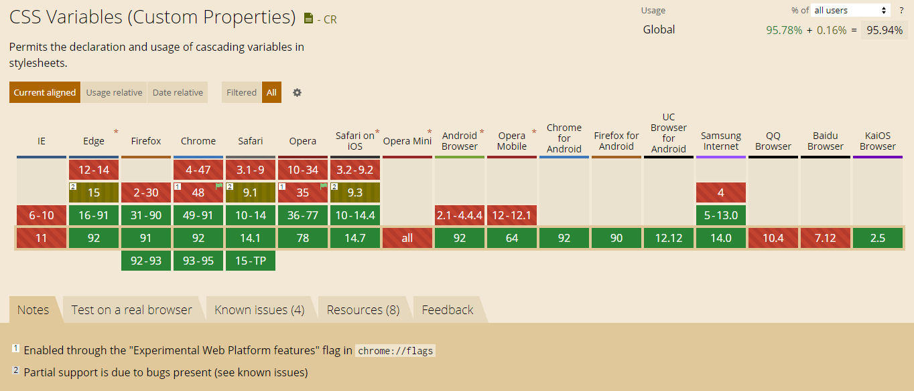

## 概述
CSS3中增加了变量函数var, 当然这些变量在less/sass等css预编译语言中早有实现，CSS标准也已经支持，并且也有着不错的兼容性：

<!-- more -->

## 语法

var的标注语法如下

    var( <custom-property-name> [, <declaration-value> ]? ) // var( <自定义属性名> [, <默认值 ]? )

代码展示

    :root{
      --blue:#2196f3;
    }
    .box{
      --size:20px;
      background-color: var(--blue);
      font-size: var(--size);
    }
放在root下即为全局变量，在选择器的声明块内就只在当前块区域有效。

我们利用这个属性实现一个简单的换肤功能，代码如下：

      <!-- css部分 -->
        
        <body>
        <!-- HTML部分 -->
        

          

            <button class="btn" data-color="red" style="color:var(--red)">更换背景色1</button>
            <button class="btn" data-color="blue" style="color:var(--blue)">更换背景色2</button>
            <button class="btn" data-color="grey" style="color:var(--grey)">更换背景色3</button>
          

          

        

        
      </body>

上述代码中有js检测控制变量的部分，效果如下

  

## 其他

### 空格问题
因为CSS变量的空格尾随特性，也就是每个变量解析完自动追加一个空格

      .box{
        --border-px:2px;
        --size:20;
        border:var(--border-px)solid black;
        font-size: var(--size)px;
      }

等同于

    .box{
        border:2px solid black;
        font-size: 20 px;
      }

所以font-size部分的值不会生效，我们可以利用calc函数再进行一次计算

    .box{
        --border-px:2px;
        --size:20;
        border:var(--border-px)solid black;
        font-size: calc(var(--size) * 1px);
      }

### 默认值问题

对于上述语法中的默认值，有一个非常有意思的一个点：对于CSS变量，只要语法是正确的，就算变量里面的值是个乱七八糟的东西，也是会作为正常的声明解析，如果发现变量值是不合法的，也不会取后面的默认值，会使用该属性的缺省值进行计算：

     .box{
        --size:#000;
        font-size: var(--size,20px);
      }

fontSize的值不是20px,而是默认继承了body的默认值，只有当变量--size不存在时，才会得到20px

## 参考
- [小tips:了解CSS变量var](https://www.zhangxinxu.com/wordpress/2016/11/css-css3-variables-var/)
- [MDN- var()](https://developer.mozilla.org/zh-CN/docs/Web/CSS/var())