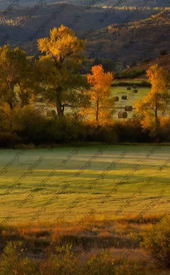
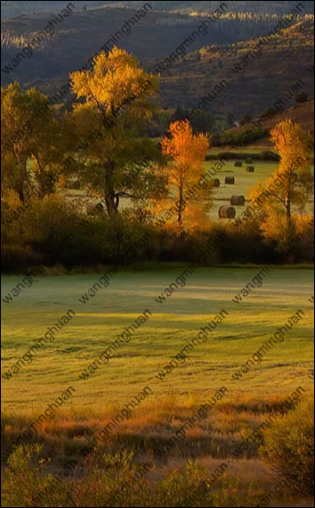

## 概述
图片水印相信大家都不陌生，在知乎、微博等地方可以经常看到。水印的作用可以基本就是为了给图片绑定身份信息，可以用来声明图片归属权，或发生信息泄露时便于定位到泄漏源。添加水印的方式有两种：后端水印和前端水印，二者各有优劣：后端水印的优势是安全，劣势是如果同一个文件在多个用户端都展示，那么就需要生成多份，无疑造成了资源浪费。前端水印不依赖服务端，完全依赖客户端的计算能力，减少服务端压力，同时可以做到千人千面，劣势是安全性较低。如何选择那就需要依据当前的使用场景。这里，对两端均做下介绍。

## nodejs的实现

服务端的实现不同语言有不同的处理方式，但原理是相同的，这里我们就采用nodejs来实现，相关的图片处理库选用[jimp](https://www.npmjs.com/package/jimp)，不像gm/node-images依赖系统库，node-gyp的安装总是出各种诡异的问题。jimp是完全用nodejs实现的，缺点是不支持gif图片的处理，不过可以使用gifwrap来补充处理，本文我们不讨论gif的处理，只处理静态图片。

### 简单水印
先实现一个简单的水印，给图片右下角添加一个水印logo

    const Jimp = require('jimp');

    // 需要添加的水印图片路径
    const ORIGINAL_IMAGE = './img/1.png';

    // 水印logo路径
    const LOGO = './img/logo.png';

    // 水印距离右下角百分比
    const LOGO_MARGIN_PERCENTAGE = 5 / 100;

    const main = async () => {
      const [image, logo] = await Promise.all([
        Jimp.read(ORIGINAL_IMAGE),
        Jimp.read(LOGO)
      ]);

      // 将 logo 等比缩小 10 倍
      // logo.resize(logo.bitmap.width / 10, Jimp.AUTO);

      const xMargin = image.bitmap.width * LOGO_MARGIN_PERCENTAGE;
      const yMargin = image.bitmap.width * LOGO_MARGIN_PERCENTAGE;

      const X = image.bitmap.width - logo.bitmap.width - xMargin;
      const Y = image.bitmap.height - logo.bitmap.height - yMargin;

      return image.composite(logo, X, Y, [
        {
          mode: Jimp.BLEND_SOURCE_OVER,
          opacitySource: 0.1,
          opacityDest: 1
        }
      ]);
    };
    // 主逻辑
    main().then(image => {
    const FILENAME = (+new Date())+'.' + image.getExtension();

    // 压缩图片 0-100
    image.quality(80);

    return image.write(FILENAME, (err) => {
      if (err) {
        return console.error(err);
      };
      console.log('水印成功：', FILENAME);
    });
  });

 运行后得到如下图片

  

### 全屏倾斜
通常情况下，我们看到的更多的情况是整张图都被覆盖了倾斜的文本说明，我们再看下基于jimp如何实现

    const Jimp = require('jimp');
    // 需要添加的水印图片路径
    const ORIGINAL_IMAGE = './img/1.png';
    const WATER_TEXT="wangminghuan";
    const main = async () => {
      const [image, font] = await Promise.all([
        Jimp.read(ORIGINAL_IMAGE),
        Jimp.loadFont(Jimp.FONT_SANS_16_BLACK)
      ]);
      // 图片宽+高得到一个正方形水印图尺寸
      // 这样可以保证无论水印基于中心点如何旋转，始终可以覆盖图片
      let maxWidth=image.bitmap.width+image.bitmap.height;
      // const rotateWith= Math.ceil(Math.sqrt(Math.pow(image.bitmap.width,2)/2)+Math.sqrt(Math.pow(image.bitmap.height,2)/2))
      const space=20;
      let textImage = new Jimp(maxWidth, maxWidth, 0x0);
      let textWidth = Jimp.measureText(font, WATER_TEXT);
      let textHeight = Jimp.measureTextHeight(font, WATER_TEXT);
      let colNum = Math.ceil(maxWidth / (textWidth+space));
      let rowNum = Math.ceil(maxWidth / (textHeight+space))
      // 按行列循环渲染
      for (let i = 0; i < rowNum; ++i) {
        for (let j = 0; j < colNum; ++j) {
          textImage.print(font, (space+textWidth)*j, (space+textHeight)*i, WATER_TEXT,maxWidth,maxWidth)
        }
      }
      // 旋转后裁剪水印图片并与原始图片合成为一张图
      return textImage.rotate(45,false).crop(image.bitmap.height/2,image.bitmap.width/2,image.bitmap.width,image.bitmap.height)
      .composite(image, 0, 0, {
        mode: Jimp.BLEND_MULTIPLY,
        opacitySource: 1,
        opacityDest: 0.3
      })
    };
    main().then(image => {
      const FILENAME = (+new Date())+'.' + image.getExtension();

      // 压缩图片 0-100
      image.quality(80);

      return image.write(FILENAME, (err) => {
        if (err) {
          return console.error(err);
        };
        console.log('水印成功：', FILENAME);
      });
    });

 运行后得到如下图片

  

## 前端实现

### css方案

我们先看下最简单粗暴的css方案

    

    

      
    

    

效果：

但这样只是"盖"了一层dom在图片上，并且禁用的鼠标事件，修改dom可以轻易删除掉这层元素，我们再做一层简单的防护：

      let body = document.getElementsByTagName('body')[0]
      let options = {
        childList: true,
        attributes: true,
        characterData: true,
        subtree: true,
        attributeOldValue: true,
        characterDataOldValue: true
      }
      let observer = new MutationObserver((mutations, observer)=> {
      // 当attribute属性被修改
      if (mutations[0].target.id === '_waterMark') {
         // do something..
      }
      // 当id被改变时
      if (mutations[0].attributeName === 'id') {
        // do something..
      }
      // 当节点被删除
      if (mutations[0].removedNodes[0] && mutations[0].removedNodes[0].id === '_waterMark') {
       // do something..
      }
    })
    observer.observe(body, options) // 监听body节点

配合`pointer-events: none`属性，可以为整站添加一个全局水印：

### canvas 实现

上述的css方案弊端较多，右键另存图片拿到的还是原始图片，可以通过canvas进行渲染：

        /*
      @ desc 全屏倾斜生成水印
      */
        function fullRotateWatermark(canvas,text,deg){
            return new Promise((resolve, reject) => {
              const ctx = canvas.getContext('2d')
              const textHeight=15;
              const space=20;
              ctx.font = textHeight+"px Microsoft Yahei";
              ctx.fillStyle = "rgba(255, 255, 255, 0.3)";
              const textWidth=ctx.measureText(text).width+10
              const maxWidth=canvas.width+canvas.height;
              // 扩展绘画区域，画布宽+画布高直接组成正方形画布，x轴偏移画布的高度开始填充
              let colNum = Math.ceil((maxWidth) / (textWidth+space));
              let rowNum = Math.ceil((maxWidth) / (textHeight+space))
              for (let i = 0; i < rowNum; ++i) {
                for (let j = 0; j < colNum; ++j) {
                  ctx.translate(canvas.width/2, canvas.height/2) // 偏移坐标原点
                  ctx.rotate((-deg * Math.PI) / 180); // 初始偏转角度
                  ctx.fillText(text,-maxWidth/2+(space+textWidth)*j, -maxWidth/2+(space+textHeight)*i)
                  ctx.rotate((deg * Math.PI) / 180); // 偏转角度恢复，防止在原来基础上再次旋转
                  ctx.translate(-canvas.width/2, -canvas.height/2) // 坐标原点恢复
                }
              }
              canvas.toBlob(blob => resolve(blob))
          // 此处也可以直接通过canvas输出base64: canvas.toDataURL('image/png', '0.5');
        })
        }
        // 入口函数 ，选择本地图片生成水印
        function imgWatermark(text) {
          return new Promise(resolve=>{
            let input = document.createElement('input')
            input.setAttribute('type', 'file')
            input.setAttribute('accept', 'image/*')
            input.onchange = async () => {
              let img = await blobToImg(input.files[0])
              let canvas = imgToCanvas({
                obj: img,
                width: img.width,
                height: img.height
              })
              
              // let blob = await watermark(canvas, text)
              let blob = await fullRotateWatermark(canvas, text, 45)
              // 此处将Blob读取到img标签，并在dom内渲染出来；如果是上传文件，可以将blob添加到FormData中
              let newImage = await blobToImg(blob)
              resolve(newImage)
            }
            input.click()
        })
        }
        /*
          @ desc bolb对象转image
          */
        function blobToImg(blob) {
          return new Promise((resolve, reject) => {
            let reader = new FileReader()
            reader.addEventListener('load', () => {
              let img = new Image()
              img.src = reader.result
              img.addEventListener('load', () => resolve(img))
            })
            reader.readAsDataURL(blob)
          })
        }
上述方案右键图片是包含水印的，缺点也明显：图片必须支持跨域，base64处理后的图片体积也会变大。

当然，也可以通过canvas生成水印图片的base64地址，然后作为背景图插入到图片中, 这里不再赘述。

### svg 实现
对于一般的文本类水印，用canvas生成base64后，生成的base64比较大，其实css可以直接渲染SVG XML格式代码，代码量很小很多，对于上述的css方案：

      
效果如下：

 

因为svg需要转义才可以被浏览器识别，我们可以直接通过此[站点](https://www.zhangxinxu.com/sp/svgo/)操作

对于以上的前端方案，无论如何操作, 都是一些展示上的"障眼法"，如果对安全性有要求的话，唯一靠谱的还是服务端直接合成。

## 参考

- [nodejs编程实战之图片水印生成（一）](https://www.jianshu.com/p/4f1f3715b22b)
- [谈谈水印实现的几种方式](https://jishuin.proginn.com/p/763bfbd68440 )
- [学习了，CSS中内联SVG图片有比Base64更好的形式](https://www.zhangxinxu.com/wordpress/2018/08/css-svg-background-image-base64-encode/)
- [github-waterMark.vue](https://github.com/wwenj/public-component/blob/master/%E9%98%B2%E5%88%A0%E9%99%A4%E7%9A%84%E9%A1%B5%E9%9D%A2%E6%B0%B4%E5%8D%B0%E7%BB%84%E4%BB%B6/waterMark.vue)

