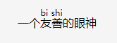

##  语义标签 
html属于标记形语言，标签语义化更接近我们平常说话的自然语言，并没有唯一的标准措辞，语义标签的使用也是一样。    

语义化的三个明确的场景：

1. 自然语言表达能力的补充：用来表达一定的结构或者消除歧义； 
2. 文章标题摘要； 
3. 适合机器阅读的整体结构

HTML最初的设计场景就是“超文本”，早期HTML工作组的专家都是出版界书籍排版的专家。

实际上，HTML这种语言，并不像严谨的编程语言一样，有一条非此即彼的线。一些语义的使用其实会带来争议，所以我的建议是：你可以尽量只用自己熟悉的语义标签，并且只在有把握的场景引入语义标签。这样，我们才能保证语义标签不被滥用，造成更多的问题。

## 其他
ruby标签的使用, 本意在东亚使用，显示的是东亚字符的发音，现在网络多用来在表情包上

    
一个<ruby>友善<rt>bi shi<rp>不支持的标签</rp></rt></ruby>的眼神

效果：

