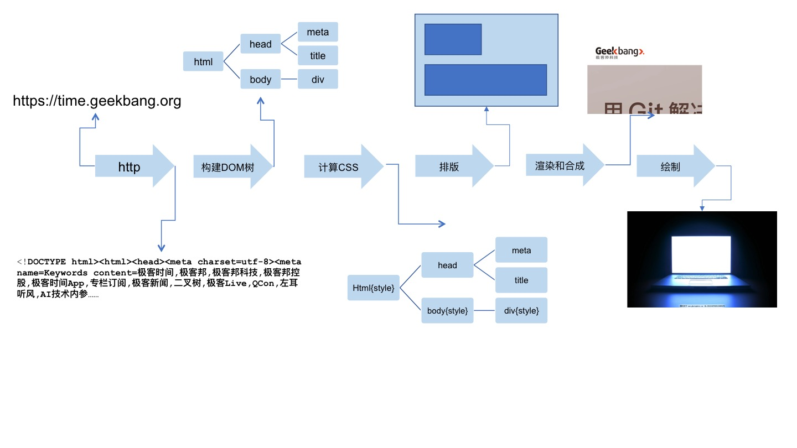
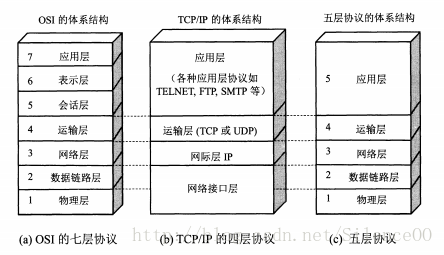
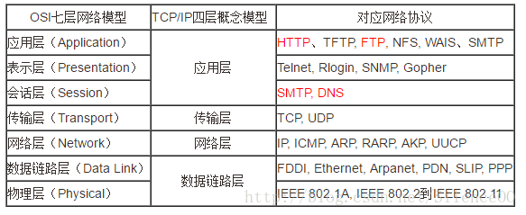
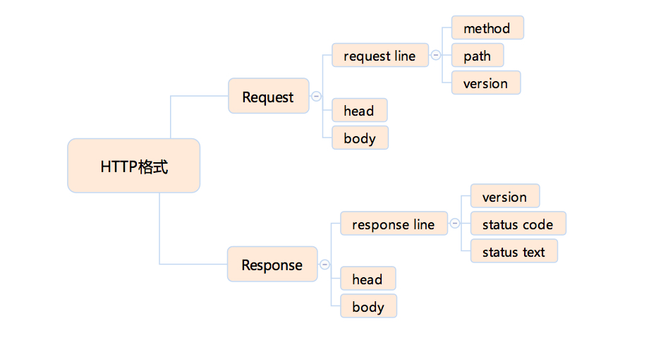

## 总流程

一个 URL 变成一个屏幕上显示的网页的流程如下：

1. 浏览器首先使用 HTTP 协议或者 HTTPS 协议，向服务端请求页面；
2. 把请求回来的 HTML 代码经过解析，构建成 DOM 树；
3. 计算 DOM 树上的 CSS 属性；
4. 最后根据 CSS 属性对元素逐个进行渲染，得到内存中的位图；
5. 一个可选的步骤是对位图进行合成，这会极大地增加后续绘制的速度；
6. 合成之后，再绘制到界面上。
<!-- more -->

从 HTTP 请求回来，就产生了流式的数据，后续的 DOM 树构建、CSS 计算、渲染、合成、绘制，都是尽可能地流式处理前一步的产出：即不需要等到上一步骤完全结束，就开始处理上一步的输出，这样我们在浏览网页时，才会看到逐步出现的页面。
## 网络协议

### 七层结构
为了使不同计算机厂家生产的计算机能够相互通信，以便在更大的范围内建立计算机网络，国际标准化组织（ISO）在1978年提出了“开放系统互联参考模型”，即著名的OSI/RM模型。它将计算机网络体系结构的通信协议划分为七层。  

### 四层结构
但是由于OSI参考模型的过于庞大、复杂，所以出现了其他模型：TCP/IP协议栈是美国国防部高级研究计划局计算机网和其后继因特网使用的参考模型，并最终成为应用最广泛的模型。

### 五层结构

五层结构只是OSI和TCP/IP的综合，实际应用还是TCP/IP的四层结构。为了方便可以把下两层称为网络接口层。

### 对比图

## HTTP 协议
因特网本身是基于TCP/IP模型的。用网络术语来说的话，HTTP(超文本传输协议)协议位于TCP的上层，是属于应用层的协议。HTTP 是纯粹的文本协议，它是规定了使用 TCP 协议来传输文本格式的一个应用层协议。HTTP协议大致分为以下部分：

### 1 请求方法
http请求方法标识此次 HTTP 请求希望执行的操作类型。方法有以下几种定义：

- GET 
- POST
- HEAD
- PUT
- 5DELECT
- CONNECT
- OPTIONS
- TRACE

浏览器通过地址栏访问页面都是 GET 方法。表单提交产生 POST 方法。  
   
HEAD 则是跟 GET 类似，只返回请求头，多数由 JavaScript 发起。  

PUT 和 DELETE 分别表示添加资源和删除资源，但是实际上这只是语义上的一种约定，并没有强约束。  

CONNECT 现在多用于 HTTPS 和 WebSocket。

PUT 和 DELETE 分别表示添加资源和删除资源，但是实际上这只是语义上的一种约定，并没有强约束。

OPTIONS 和 TRACE 一般用于调试，多数线上服务都不支持。

### 2 状态码
1. 对我们前端来说，1xx 系列的状态码是非常陌生的，原因是 1xx 的状态被浏览器 http 库直接处理掉了，不会让上层应用知晓。
2. 2xx 系列的状态最熟悉的就是 200，这通常是网页请求成功的标志，也是大家最喜欢的状态码。
3. 3xx 系列比较复杂，301 和 302 两个状态表示当前资源已经被转移，只不过一个是永久性转移，一个是临时性转移。实际上 301 更接近于一种报错，提示客户端下次别来了。304 又是一个每个前端必知必会的状态，产生这个状态的前提是：客户端本地已经有缓存的版本，并且在 Request 中告诉了服务端，当服务端通过时间或者 tag，发现没有更新的时候，就会返回一个不含 body 的 304 状态。

### 3 HTTP 头
HTTP 头可以看作一个键值对。

先来看看 Request Header:

接下来看一下 Response Header:

### 4 HTTP Request Body
http 请求的 body 是比较自由的，只要浏览器端发送的 body 服务端认可就可以了。一些常见的 body 格式是：

- application/json
- application/x-www-form-urlencoded
- multipart/form-data
- text/xml

我们使用 html 的 form 标签提交产生的 html 请求，默认会产生 application/x-www-form-urlencoded 的数据格式，当有文件上传时，则会使用 multipart/form-data。

### 5 HTTPS
HTTPS 有两个作用，一是确定请求的目标服务端身份，二是保证传输的数据不会被网络中间节点窃听或者篡改。

HTTPS 是使用加密通道来传输 HTTP 的内容。但是 HTTPS 首先与服务端建立一条 TLS 加密通道。TLS 构建于 TCP 协议之上，它实际上是对传输的内容做一次加密，所以从传输内容上看，HTTPS 跟 HTTP 没有任何区别。

### 6 HTTP 2
HTTP 2.0 最大的改进有两点，一是支持服务端推送，二是支持 TCP 连接复用。HTTP1.X的连接无法复用，这就会导致每次请求都经历三次握手和慢启动。

## 参考
1. [一文读懂HTTP/2 及 HTTP/3特性](https://mp.weixin.qq.com/s/hjxU-rjr-ISk0rzeQHAIeA)
